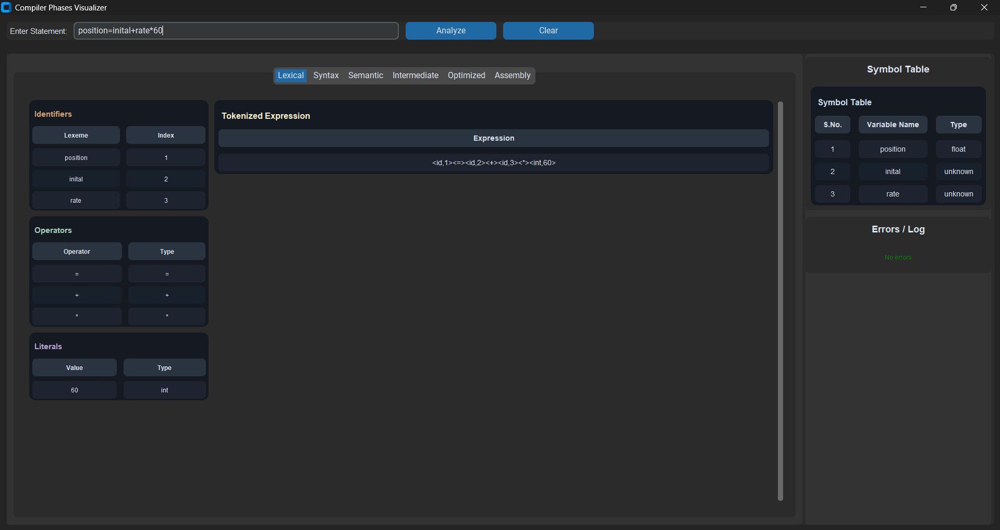

# Compiler Phases Visualizer

A desktop GUI application that visualizes how source code expressions move through compiler phases: lexical analysis, syntax parsing, semantic analysis, intermediate TAC generation, optimization, and assembly code output.

## Features

- **Full compiler pipeline** - Track a single expression from source to pseudo-assembly
- **Phase-specific views** - Grid displays for tokens, TAC, optimized TAC, and assembly; tree canvas for syntax/semantic trees
- **Type coercion visibility** - See implicit conversions like `inttofloat()` 
- **Symbol table & errors** - Live panels showing symbols and error logs

## Tech Stack

- Python 3
- CustomTkinter for UI
- anytree for tree structures
- Modular compiler phases in `core/`

## Installation

```bash
pip install -r requirements.txt
python main.py
```

## Project Structure

```
compiler_phases_visualizer/
├── core/              # Compiler phases
│   ├── lexer.py       # Tokenization
│   ├── parser.py     # AST generation
│   ├── semantic.py   # Type checking & coercion
│   ├── intermediate.py # TAC generation
│   ├── optimizer.py  # TAC optimization
│   ├── codegen.py    # Assembly code generation
│   └── symbol_table.py
├── gui/               # GUI components
│   └── main_window.py
├── utils/             # Utilities
├── main.py           # Entry point
└── requirements.txt
```

## Example

Input expression: `position=inital+rate*60;`

more examples : `result = a + 4 * (c - d) - ((a+c) - b) * d;`

| Phase | Screenshot |
|-------|-----------|
| Lexical Analysis |  |
| Syntax Analysis |  |
| Semantic Analysis |  |
| Intermediate TAC |  |
| Optimized TAC |  |
| Assembly |  |

## Usage

Enter an expression and click "Analyze" to see all phases render in their respective tabs.