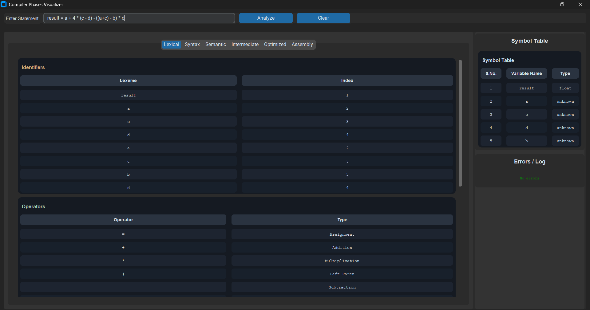
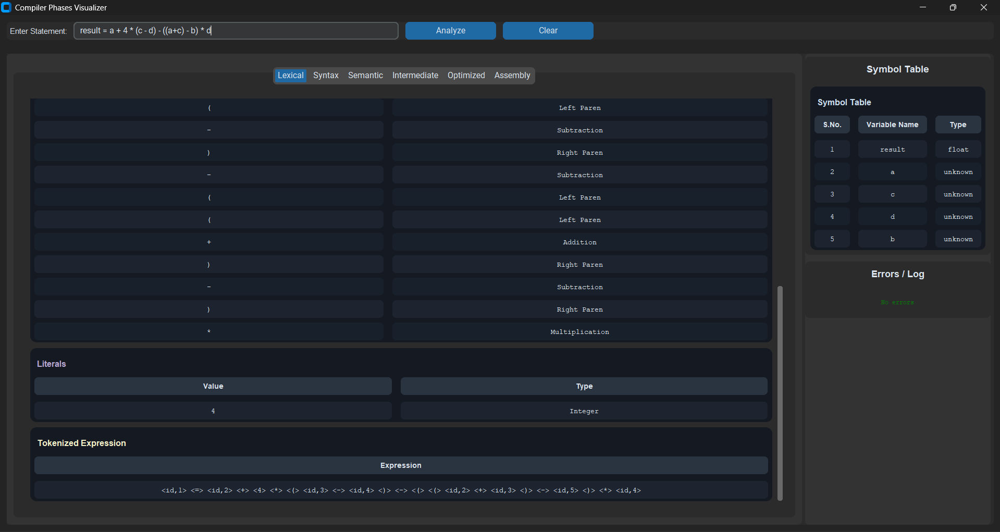
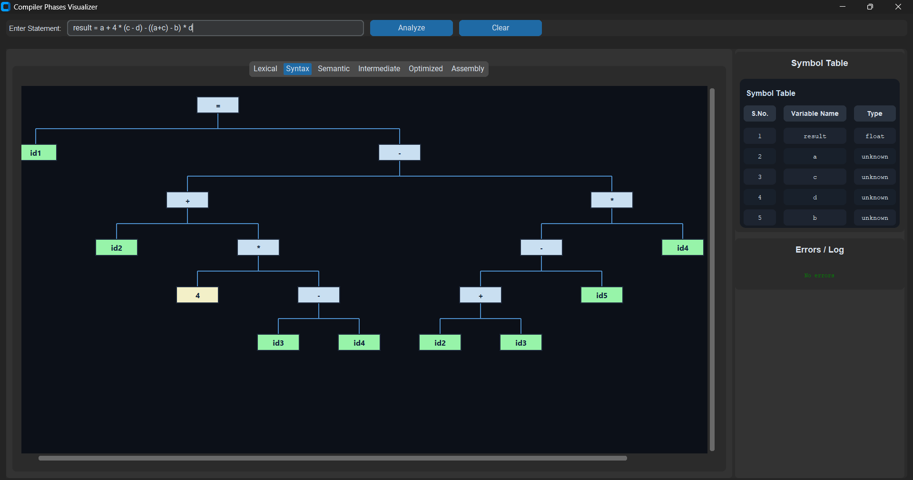
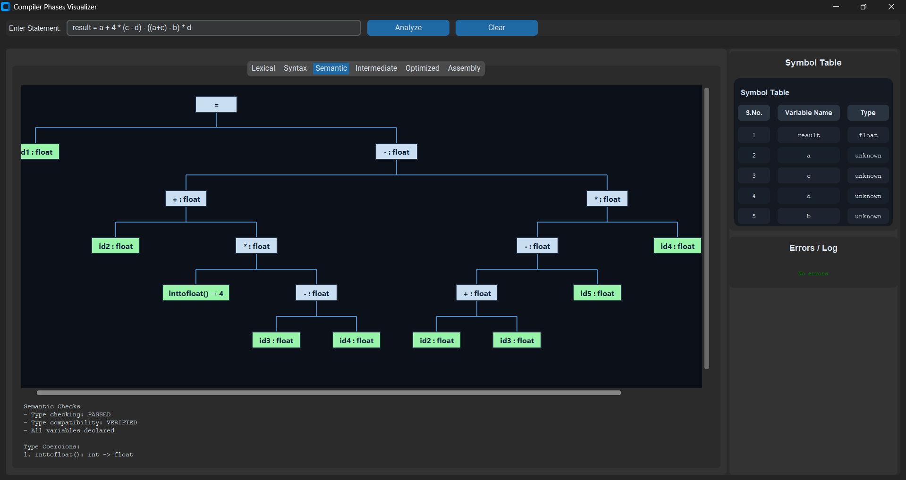
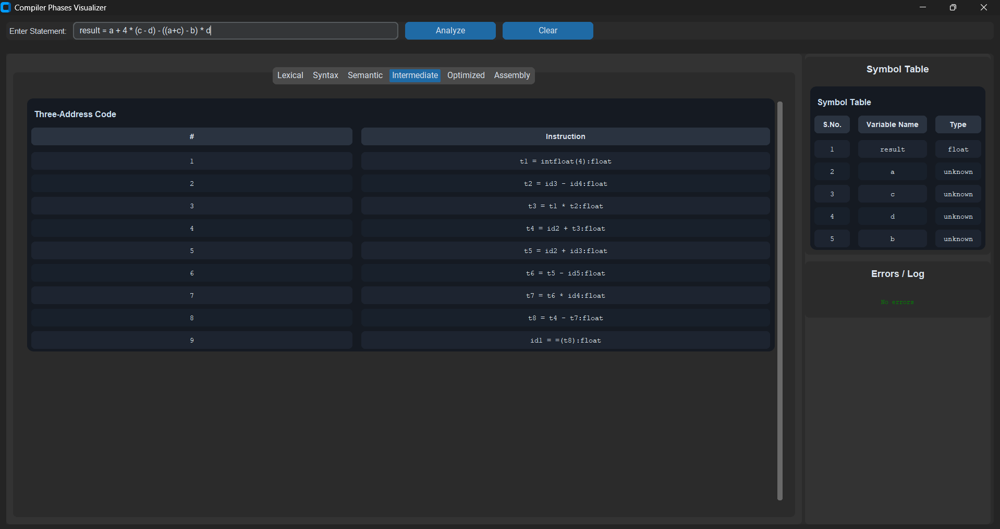
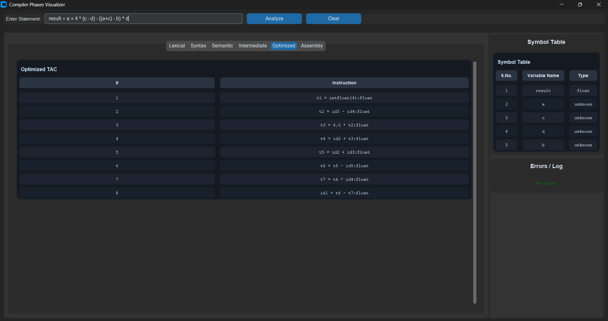
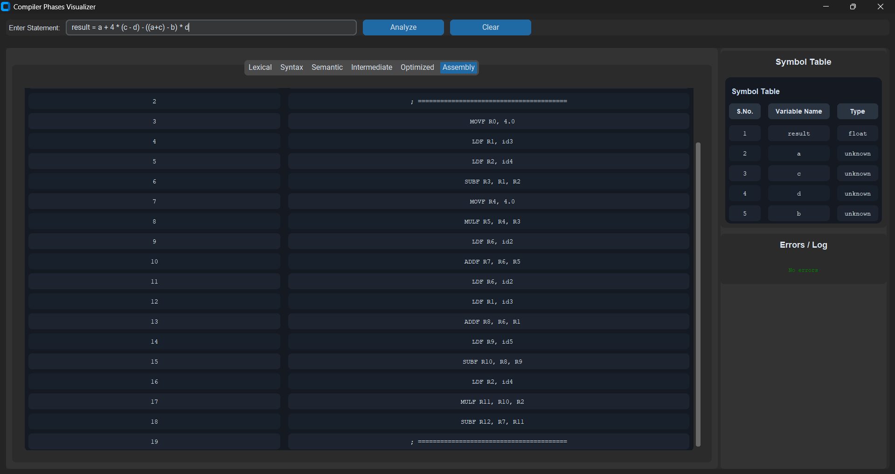

# Compiler Phases Visualizer

A desktop GUI visualizer that shows how a single expression moves through compiler phases:
Lexical Analysis, Syntax Tree, Semantic Analysis, Intermediate TAC, Optimized TAC, and Assembly generation.

## Features

- End-to-end compiler pipeline from source statement to pseudo assembly
- Grid-based data views for lexical tokens, TAC, optimized TAC, assembly, and symbol table
- Canvas-based hierarchical trees for syntax and semantic phases
- Type coercion visibility (example: `inttofloat()`)
- Live error panel and symbol table panel

## Tech Stack

- Python 3
- CustomTkinter + Tkinter Canvas
- Modular compiler phases in `core/`

## Project Structure

```text
core/            # lexer, parser, semantic analyzer, TAC, optimizer, codegen
gui/             # app window, tabs, tree canvas, grid cards
tests/images/    # screenshots used in this README
main.py          # app entry point
```

## Run Locally

```bash
pip install -r requirements.txt
python main.py
```

## Test Example Used

The screenshots below use this input statement:

```text
result = a + 4 * (c - d) - ((a+c) - b) * d
```

Pipeline status for this test:

- Lexical errors: none
- Parse errors: none
- Semantic errors: none
- Coercions detected: `inttofloat(): int -> float`

## Section-by-Section Results

### 1) Lexical Analysis

**What was tested**
- Token classification into identifiers, operators, literals
- Tokenized expression highlighted in its own single-row grid

**Observed result**
- Identifiers include `result, a, c, d, b`
- Operators include `= + * ( ) -`
- Literal `4` detected as integer and shown separately
- Full tokenized expression rendered in one dedicated row




### 2) Syntax Analysis

**What was tested**
- Hierarchical AST generation with operator precedence and grouping

**Observed result**
- Assignment root `=`
- Left side as `id1`
- Right side reflects nested arithmetic structure with proper precedence and parentheses



### 3) Semantic Analysis

**What was tested**
- Type propagation and coercion annotation in semantic tree

**Observed result**
- Semantic nodes show `:float` annotations
- Integer constant `4` wrapped as `inttofloat() -> 4`
- Semantic checks shown as passed



### 4) Intermediate Code (Three-Address Code)

**What was tested**
- TAC instruction generation from semantic tree

**Observed result**
- Example TAC sequence generated:

```text
t1 = intfloat(4):float
t2 = id3 - id4:float
t3 = t1 * t2:float
...
id1 = =(t8):float
```



### 5) Optimized TAC

**What was tested**
- Optimization pass over TAC (constant/copy simplifications)

**Observed result**
- Reduced and simplified instruction stream
- Example optimization effect:

```text
Before: t3 = t1 * t2:float
After:  t3 = 4.0 * t2:float
```



### 6) Assembly Generation

**What was tested**
- Translation of optimized TAC into floating-point pseudo assembly

**Observed result**
- Register-based sequence generated (sample):

```text
MOVF R0, 4.0
LDF R1, id3
LDF R2, id4
SUBF R3, R1, R2
...
SUBF R12, R7, R11
```



## Symbol Table and Error Panel

The right panel in each screenshot also confirms:

- Symbol table entries with stable IDs and inferred type labels
- Errors/Log showing `No errors` for this test run

## Notes

- Syntax and Semantic tabs intentionally use tree canvas rendering, not grid tables.
- Lexical, TAC, Optimized, Assembly, and Symbol Table are shown as grid cards for readability.
